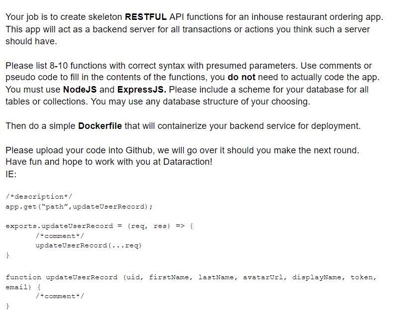

# Dataraction_Work

Task:

List of functions for the restaurant ordering app (all inside the operations folder):

Cashier.js contains the following: 

1. addCashier: accepts the following parameters (title, gender) and create a new	 cashier record in the DB 
 
2. getCashier: this accepts 1 parameter (id) which is unique to each record in the	DB, this function uses the id	to get the cashier with that unique id	 
 
3. getCashiers: this function returns all the cashiers in the database 
 
Food.js contains the follwing:
 
1. addFoodMenu: accepts the following parameters (title, price, category) and	 create a new food menu record in the DB 
 
2. getFoodMenu: this function returns all the food menu in the database 
 
3. removeFoodMenu: this function uses the unique to delete a food menu record and yes it accepts 1 parameter which is (id). 

Order.js contains the following: 

1. addOrder: accepts the following parameters (items, cashier, total_price,	 amount_paid, change_returned, payment_mode) and creates a new order record in the DB 
 
2. getOrder: this accepts 1 parameter (id) which is unique to each record in the	 DB, this function uses the id to get the order with that unique id	 
 
3. getOrders: this function returns all the orders in the database 
 
4. fulfilOrder: this function uses the unique id to make an order delivered and it accepts 1 parameter which is (id). 
 
5. cancelOrder: this function marks an order cancelled using the unique id which is the parameter the function accepts 

Controller: this folder contains files that are used by the route to perform the right	operation. 
 
EX: const foodController = require(‘./controller/foodmenu.controller’); app.get(‘/menu’, foodController.getFoodMenu); 
 
Cashier.controller.js: This file serves as the intermediary between the cashier routes and cashier logics, this controller file also helps to parse both request body and parameters, and also handles the HTTP responses for each route. Same for foodmenu.controller.js and order.controller.js 

Models: This folder contains the database schemas/structure (MongoDB is used for the app). 
